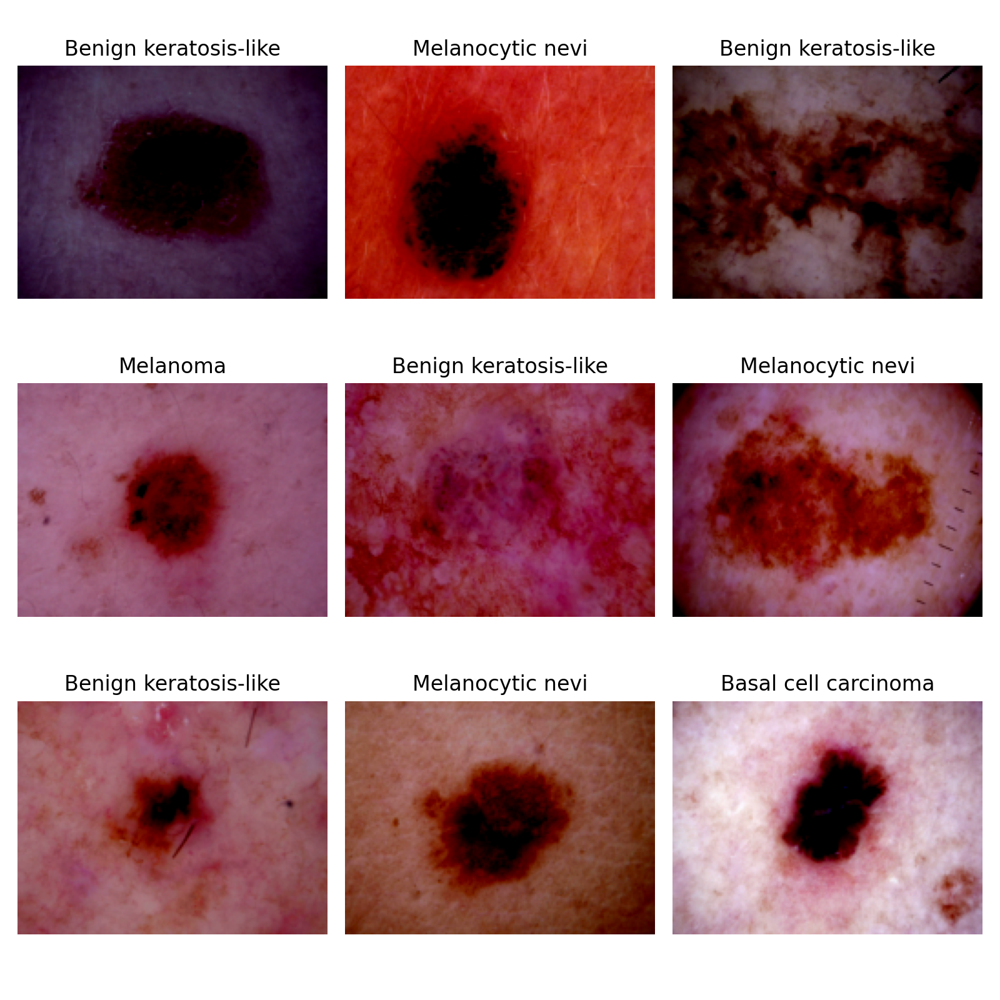

# Generating synthetic medical images
Automated diagnosis of any kind are hampered by the small size, lack of 
diversity and expensiveness of available dataset of medical images. To tackle
this problem, several approaches using generative models have been applied.

Thence, in this project we will be using a (conditional) Generative 
Adversarial Network (cGAN) to synthetically generate medical images; 
concretely, of dermatoscopic images of pigmented skin lesions.

### Original samples



## Dataset

We will use the [HAM10000 dataset](https://arxiv.org/abs/1803.10417) 
("Human Against Machine with 10000 training images"), 
published in the 2018. In the words of the authors:
<figure>
    <blockquote>
        <p> We collected dermatoscopic images from different populations 
        acquired and stored by different modalities. Given this diversity 
        we had to apply different acquisition and cleaning methods and 
        developed semi-automatic workflows utilizing specifically trained 
        neural networks. The final dataset consists of 11788 dermatoscopic 
        images, of which 10010 will be released as a training set for 
        academic machine learning purposes and will be publicly available 
        through the <a href=https://challenge.isic-archive.com/landing/2018/>ISIC</a> 
        archive. This benchmark dataset can be used for machine learning and 
        for comparisons with human experts. Cases include a representative 
        collection of all important diagnostic categories in the realm of 
        pigmented lesions. More than 50% of lesions have been confirmed by 
        pathology, the ground truth for the rest of the cases was either 
        follow-up, expert consensus, or confirmation by in-vivo 
        confocal microscopy.</p>
    </blockquote>
</figure>

This same dataset, has been uploaded at several places:
- [Harvard Dataverse](https://dataverse.harvard.edu/dataset.xhtml?persistentId=doi:10.7910/DVN/DBW86T)
- [Kaggle](https://www.kaggle.com/datasets/kmader/skin-cancer-mnist-ham10000/download?datasetVersionNumber=2): **downloaded from here**

### Technical information

Training of neural networks for automated diagnosis of pigmented skin lesions is hampered by the small size and lack of diversity of available dataset of dermatoscopic images. This problem was tackled by releasing the HAM10000 ("Human Against Machine with 10000 training images") dataset. The authors collected dermatoscopic images from different populations, acquired and stored by different modalities. The final dataset consists of 10015 dermatoscopic images which can serve as a training set for academic machine learning purposes. Cases include a representative collection of all important diagnostic categories in the realm of pigmented lesions: 
- Actinic keratoses and intraepithelial carcinoma / Bowen's disease (`akiec`, `0` labeled)
- Basal cell carcinoma (`bcc`, `1` labeled)
- Benign keratosis-like lesions: solar lentigines / seborrheic keratoses and lichen-planus like keratoses (`bkl`, `2` labeled)
- Dermatofibroma (`df`, `3` labeled)
- Melanoma (`mel`, `4` labeled)
- Melanocytic nevi (`nv`, `5` labeled)
- Vascular lesions: angiomas, angiokeratomas, pyogenic granulomas and hemorrhage (`vasc`, `6` labeled).

The ground-truth of the lesions are confirmed through:
- Histopathology (`histo`): more than 50% of lesions
- Follow-up examination (`follow_up`)
- Expert consensus (`consensus`)
- Confirmation by in-vivo confocal microscopy (`confocal`). 
These are labeled accordingly in the `dx_type` column of the `HAM10000_metadata.csv`. 

Due to upload size limitations, images were stored in two files:
- `HAM10000_images_part_1`: with 5000 `.jpg` files
- `HAM10000_images_part_2`: with 5015 `.jpg` files


The dataset includes lesions with multiple images, which can be tracked by the `lesion_id` column within the `HAM10000_metadata.csv` file. This file contains the following columns:
- `image_id`: `id` and name with which the image can be found in one of `HAM10000_images_part_1` or `HAM10000_images_part_2` folders
- `lesion_id`: `id` of the lesion (note one lesion can contain more than one image)
- `dx_type`: 4-category procedure of the diagnostic (through which `dx` was confirmed)
- `age`: age of the patient as integer 
- `sex`: `male` or `female` in function of the biological sex of the patient
- `localization`: body part in which the lesion is found
- `dx`: the **ground-truth**, _i.e._ our label

### Other medical images datasets
There are plenty of medical images datasets. Below we list some websites which may prove useful:
- The [MedMNIST v2 dataset](https://medmnist.com/) is the MNIST of Medical Imaging containing a large-scale MNIST-like collection of standardized biomedical images.
- [Torch's Medical Images Datasets](https://torchio.readthedocs.io/datasets.html)
- [Dermatology Image Bank from the University of Utah](https://library.med.utah.edu/kw/derm/)

There are lots of general datasets' repositories out there, which may be worht looking at:
- [Zenodo](https://zenodo.org/)
- [Hugging Face](https://huggingface.co/docs/datasets/)

## Reproducing the results 

### Dedicated `conda` environment

To run the code locally (without any Docker container), I installed pytorch
(with GPU support) in a dedicated conda environment by following this 
[guide](https://pub.towardsai.net/installing-pytorch-with-cuda-support-on-windows-10-a38b1134535e#98b9).

Note the cuDNN files have to be copied at 
`C:\Program Files\NVIDIA GPU Computing Toolkit\CUDA\v11.8`. Once, `CUDA 11.8` 
and the compatible `cuDNN` version are installed, we set up GPU-`pytorch` 
through `conda` according to the [official website](https://pytorch.org/get-started/locally/#anaconda).

```bash
conda create -n hamgan python=3.9
conda activate hamgan
conda install pytorch torchvision torchaudio pytorch-cuda=11.8 -c pytorch -c nvidia -y
conda install jupyter notebook pandas matplotlib seaborn -y
```

#### Set up a dedicated jupyter kernel

In order to run the repo `.ipynb` we need to set up our `conda` environment
as jupyter kernel, by typing:
```bash
python -m ipykernel install --user --name=hamgan
```
